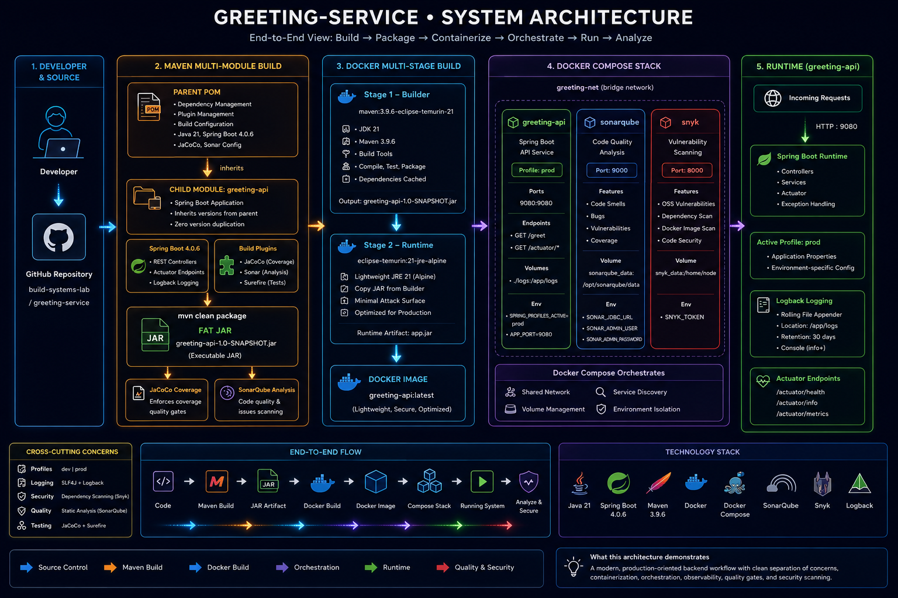
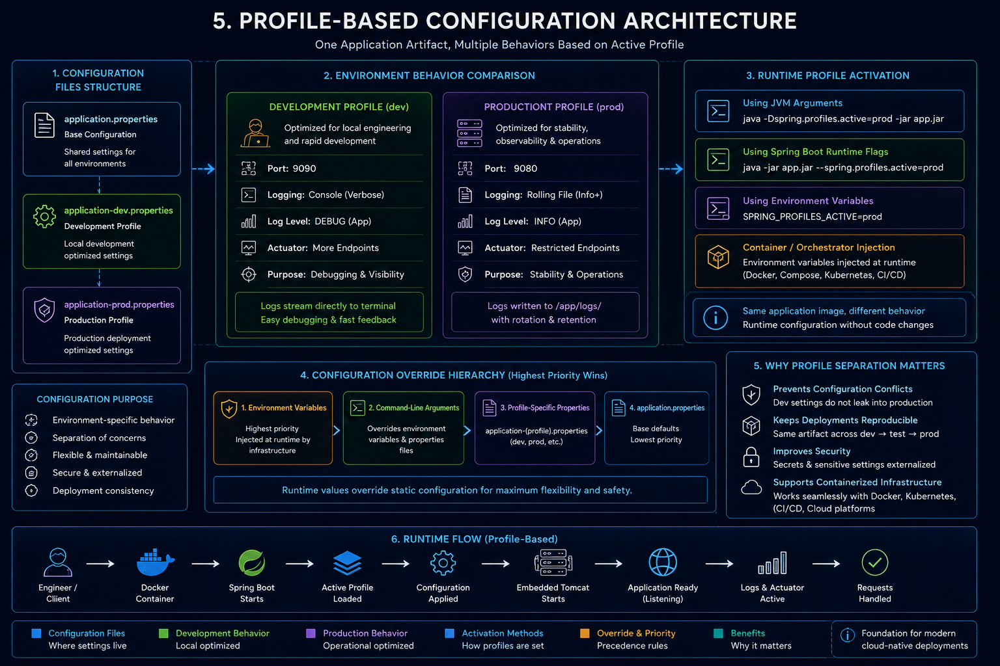
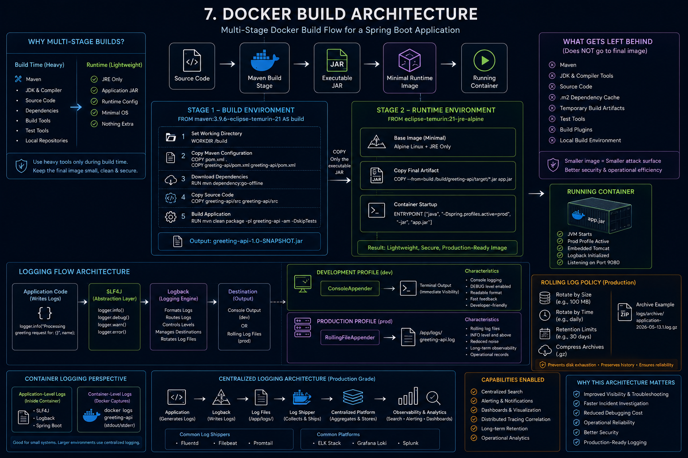
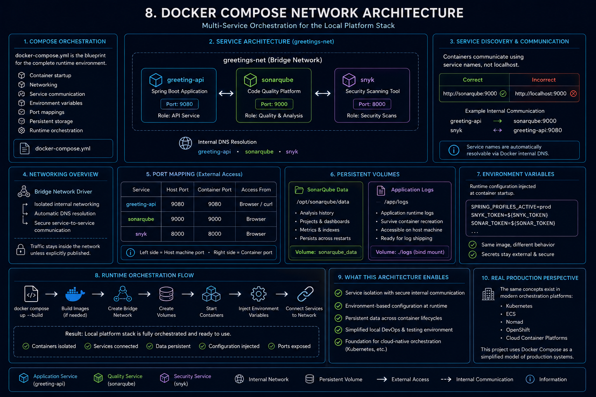
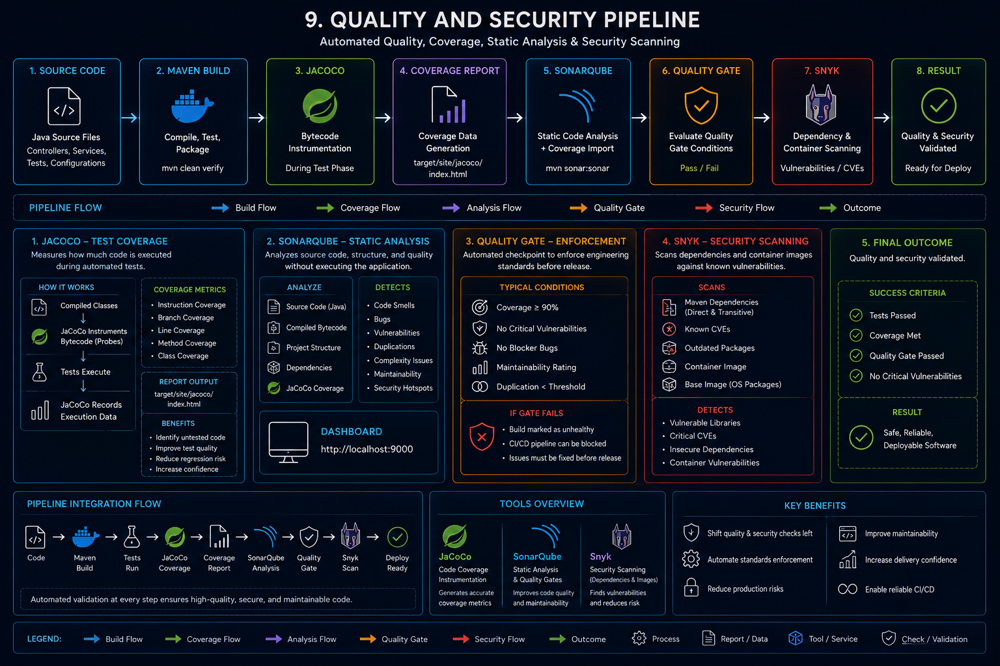
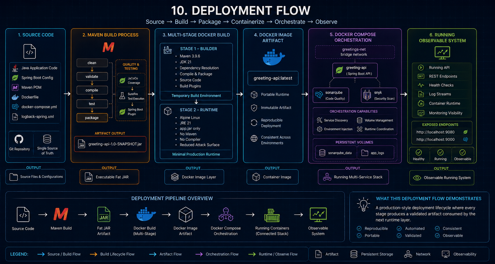
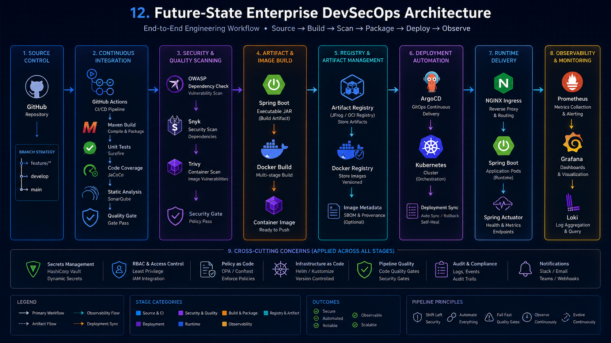

# 1. What This System Is

`greeting-service` is a production-style Spring Boot microservice built to demonstrate how modern backend systems are structured, packaged, and shipped. The application itself is simply a greeting endpoint but the engineering layer around it is the real subject: a Maven multi-module build, profile-driven configuration, Docker containerization, local service orchestration with Docker Compose, structured logging, static analysis with SonarQube, and dependency scanning with Snyk. The system moves through a complete delivery pipeline from source code to a running, observable container, and every tool in the stack exists to show how that pipeline behaves in a real engineering environment.

---

## 2. System Architecture — The Big Picture

An end-to-end view of how the system moves from source code through the Maven build, Docker packaging, Compose orchestration, and into a running observable application.

  

The diagram shows the full end-to-end flow of the system — from the developer and source code through the Maven build, Docker packaging, Compose orchestration, and into the running runtime with observability and security tooling around it.

---

## 3. Maven Multi-Module Architecture

A look at how the parent and child POM relationship is structured and how configuration flows down into the build lifecycle.

  

The diagram shows the parent-child POM relationship — how the parent centralizes dependency management, plugin management, and build configuration, and how the child module inherits that shared setup before being packaged into an executable JAR and transformed into a Docker image through the Maven lifecycle.

---

## 4. Application Runtime Flow

How an incoming HTTP request moves through the containerized application from entry point to response.

  

The container starts the application with the prod profile active, which loads the port, logging, and actuator configuration. Incoming requests hit Docker's port mapping at `9080:9080`, pass through embedded Tomcat into the `GreetingController`, where the name parameter is extracted, sanitized, and logged through SLF4J before a plain text response is returned. Actuator endpoints at `/actuator/health` and `/actuator/info` run alongside the application, exposing runtime health without touching application internals.

---

## 5. Profile-Based Configuration Architecture

How the application loads different configuration depending on the environment it is running in.

  

The application uses three layered properties files — `application.properties` as the shared base, `application-dev.properties` for local development on port `9090` with console logging, and `application-prod.properties` for the container runtime on port `9080` with rolling file logging. The active profile is injected at startup through a JVM argument, environment variable, or Docker Compose configuration, which means the same artifact runs in both environments without any code changes.

---

## 6. Logging Architecture

How log events travel from application code through SLF4J and Logback to their final destination depending on the active profile.

  

The application writes logs through SLF4J, which acts as an abstraction layer sitting between the code and Logback — the actual logging engine. Logback reads the active Spring profile at startup and activates the correct configuration block from `logback-spring.xml`: in dev, logs stream to the console at DEBUG level; in prod, logs are written to a `RollingFileAppender` at `/app/logs/` with size and time-based rotation to prevent disk saturation.

---

## 7. Docker Build Architecture

How the application moves from source code into a lightweight production container image through a two-stage build process.

  

Stage 1 uses a full Maven and JDK image to compile, resolve dependencies, and package the application into an executable JAR. Stage 2 starts fresh from a minimal JRE Alpine image and copies only the final JAR across — leaving behind the compiler, Maven, source code, and dependency cache. The result is a lightweight production image containing nothing beyond the Java runtime and the application artifact.

---

## 8. Docker Compose Network Architecture

How the three containers are connected, networked, and orchestrated together as a single local stack.

  

Docker Compose provisions `greeting-api`, `sonarqube`, and `snyk` as connected services on a shared bridge network called `greetings-net`, where containers discover each other by service name rather than IP address — so `greeting-api` reaches SonarQube at `http://sonarqube:9000` internally. Port mappings expose selected services to the host machine, persistent volumes keep SonarQube data and application logs alive across container restarts, and environment variables inject runtime configuration like `SPRING_PROFILES_ACTIVE=prod` and `SNYK_TOKEN` at startup without touching the image.

---

## 9. Quality and Security Pipeline

How JaCoCo, SonarQube, and Snyk work together to validate code quality and security before the application is considered deployable.

  

JaCoCo instruments the bytecode during the test phase and generates a coverage report, which SonarQube then consumes alongside the source code to produce a full static analysis — checking for bugs, code smells, duplication, and maintainability issues against a quality gate. Snyk runs independently against the Maven dependency tree and the Docker image, scanning for known CVEs and vulnerable transitive dependencies that static analysis alone would not catch.

---

## 10. Deployment Flow

How the system moves stage by stage from source code into a running observable platform.

  

`mvn clean package` compiles, tests, and packages the application into an executable fat JAR, which Docker then picks up through a multi-stage build to produce the lightweight `greeting-api:latest` image. `docker compose up --build` takes that image and brings up the full stack — creating the network, mounting volumes, injecting environment variables, and starting all three containers as a connected operational environment.

---

## 11. Architecture Decisions and Tradeoffs

The reasoning behind the four major structural decisions made across this project.

### Multi-Module Maven Architecture

A single-module structure would have worked for a project this size, but the parent-child split was intentional. The parent POM centralizes dependency versions, plugin configuration, and build behavior in one place — meaning if a new module gets added later, it inherits everything without duplication. The tradeoff is a more complex build structure, which surfaced during Docker builds when the parent POM could not be resolved from the wrong build context. That failure was itself a useful lesson in how multi-module systems behave in containerized environments.

### logback-spring.xml Over application.properties Logging

Spring Boot supports basic logging configuration directly through `application.properties`, but this project uses `logback-spring.xml` because the production logging requirements went beyond what property-based configuration handles cleanly. Rolling file appenders, profile-aware blocks, retention policies, and separate dev and prod destinations all require Logback's XML configuration system. The tradeoff is a more verbose and harder-to-read file, but the result is a logging setup that reflects how production systems are actually configured.

### Multi-Stage Docker Build

A single-stage build would place Maven, the JDK, source code, and build tooling inside the final runtime image. Multi-stage builds solve this by using the first stage purely for compilation and packaging, then copying only the executable JAR into a minimal JRE Alpine image for runtime. Everything else — Maven, the compiler, the source code, the dependency cache — gets discarded. The result is a smaller, more secure image with a reduced attack surface. The tradeoff is slightly more complex Dockerfile configuration and harder debugging if the build stage fails.

### Spring Profiles Over Hardcoded Configuration

Hardcoding environment-specific values into the application creates deployments that are tightly coupled to one environment. Spring profiles solve this by separating dev and prod configuration into dedicated property files that activate at runtime through a single environment variable — `SPRING_PROFILES_ACTIVE`. The same JAR runs locally on port `9090` with console logging and in the production container on port `9080` with rolling file logging without any code changes. The tradeoff is additional configuration files to manage, but the deployment flexibility and environment separation are worth it.

### JaCoCo Coverage Gate at 80%

The 80% instruction coverage threshold was chosen as a practical middle ground. Too low and the gate stops being meaningful — it allows large areas of untested code to ship unchecked. Too high and engineers start writing tests purely to hit a number rather than to validate behavior, producing brittle test suites with meaningless assertions. 80% enforces real testing discipline without becoming an obstacle. Coverage is treated here as an engineering signal, not as the definition of quality.

---

## 12. Future-State Enterprise DevSecOps Architecture

Where the architecture naturally grows from here as the system scales into a full production engineering workflow.

The diagram above maps the complete end-to-end pipeline — Source → Build → Scan → Package → Deploy → Observe — across eight stages with cross-cutting concerns applied at every layer.

---

### Stage 1 — Source Control

GitHub remains the foundation. The evolution introduces a formal branch strategy — `feature/*` branches feeding into `develop`, which merges into `main`. This controls what gets built, when, and by whom, preventing unstable code from reaching the pipeline.

### Stage 2 — Continuous Integration

GitHub Actions automates the entire build pipeline on every push. Maven compiles and packages the application, Surefire runs unit tests, JaCoCo enforces coverage, SonarQube performs static analysis, and a quality gate validates everything before the pipeline continues. Nothing moves forward without passing the gate.

### Stage 3 — Security and Quality Scanning

Three dedicated security layers run in sequence. OWASP Dependency Check scans Maven dependencies for known vulnerabilities. Snyk performs a deeper security scan across the dependency tree. Trivy scans the container image for OS-level and runtime vulnerabilities. A security gate at the end of this stage blocks the pipeline if any critical issues are found.

### Stage 4 — Artifact and Image Build

Spring Boot packages the application into an executable JAR. Docker picks it up through the multi-stage build — the builder stage compiles and packages, the runtime stage produces a lightweight container image. The final container image is validated and ready to push.

### Stage 5 — Registry and Artifact Management

The container image is pushed to an artifact registry — JFrog Artifactory or any OCI-compatible registry. Docker Registry stores versioned images. Image metadata, SBOM, and provenance information are attached to the artifact, giving the pipeline full traceability from source commit to deployed image.

### Stage 6 — Deployment Automation

ArgoCD takes the versioned image and handles GitOps continuous delivery — syncing the desired state from Git into the cluster automatically. Kubernetes orchestrates the running containers with self-healing, rolling deployments, and automatic rollback. Deployment sync keeps the cluster state aligned with what is declared in the repository.

### Stage 7 — Runtime Delivery

NGINX Ingress sits in front of the cluster handling reverse proxy, routing, and TLS termination. Spring Boot runs inside Kubernetes pods with the production profile active. Spring Actuator exposes health and metrics endpoints consumed by the observability layer.

### Stage 8 — Observability and Monitoring

Prometheus collects metrics from Actuator endpoints and fires alerts. Grafana visualizes those metrics as operational dashboards. Loki aggregates logs from all running containers and makes them queryable — replacing the mounted volume approach with centralized, searchable log infrastructure.

---

### Cross-Cutting Concerns

These apply across every stage of the pipeline, not just at specific points.

**Secrets Management** — HashiCorp Vault replaces static environment variables with dynamic secrets, rotation policies, and audit logging. Containers retrieve credentials at startup rather than having them embedded in configuration.

**RBAC and Access Control** — Least privilege access enforced through IAM integration. No service or engineer has more access than their role requires.

**Policy as Code** — OPA and Conftest enforce security and compliance policies automatically as part of the pipeline, not as manual review steps.

**Infrastructure as Code** — Helm and Kustomize manage Kubernetes manifests declaratively. Every infrastructure change is version controlled and reproducible.

**Pipeline Quality** — Code quality gates and security gates run at multiple points. Nothing reaches production without passing both.

**Audit and Compliance** — Logs, events, and audit trails are captured across every stage for compliance and incident investigation.

**Notifications** — Slack, email, and webhook integrations alert the right people when gates fail, deployments succeed, or incidents occur.

---

### Pipeline Principles

The architecture is built around five engineering principles that apply regardless of which tools are in use.

**Shift Left Security** — security scanning happens early in the pipeline, not after deployment. Finding vulnerabilities at build time is significantly cheaper than finding them in production.

**Automate Everything** — every manual step is a source of inconsistency. The pipeline enforces quality, security, and deployment automatically without human intervention at each stage.

**Fail Fast** — quality gates and security gates fail the pipeline immediately when thresholds are not met. Fast failure is cheaper than slow discovery.

**Observe Continuously** — metrics, logs, and alerts run continuously in production. The system is always visible, not just when something breaks.

**Evolve Continuously** — the pipeline is designed to grow. New tools, new stages, and new policies can be added without rebuilding the foundation.

  

