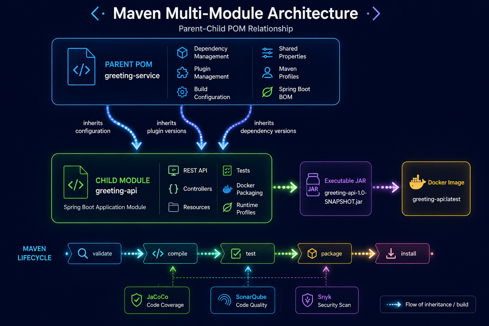

# 1. What This System Is

`greeting-service` is a production-style Spring Boot microservice project built to demonstrate how modern backend systems are structured, packaged, containerized, analyzed, and deployed in real engineering environments. Although the application itself exposes a simple greeting endpoint, the real focus of the project is the engineering ecosystem surrounding the application — multi-module Maven architecture, profile-driven configuration, containerization with Docker, local service orchestration using Docker Compose, centralized logging behavior, static code analysis with SonarQube, dependency vulnerability scanning with Snyk, and production-oriented deployment practices. The system is intentionally designed to simulate how software moves through a real delivery pipeline: source code is managed through a parent-child Maven structure, packaged into a deployable fat JAR, transformed into a lightweight runtime container through a multi-stage Docker build, and orchestrated alongside supporting services as a complete local stack. The architecture favors separation of concerns, maintainability, reproducibility, and operational clarity, making the project less about the complexity of the business logic itself and more about understanding the full lifecycle of how backend systems are built and shipped in modern DevOps-oriented environments.

---

## System Architecture — The Big Picture

At a high level, the system is designed as a complete backend engineering workflow rather than just a standalone Spring Boot application. The project starts from a developer-controlled multi-module Maven build, where dependency management, plugin management, profiles, and build consistency are centralized through the parent POM. The `greeting-api` child module then inherits that shared configuration and produces the actual deployable application artifact.

Once the application is packaged into an executable Spring Boot JAR, Docker takes over the deployment responsibility through a multi-stage build process. The first stage handles compilation and packaging using Maven and JDK tooling, while the second stage produces a smaller production-ready runtime image that only contains the application and the minimal Java runtime required to execute it.

Docker Compose then orchestrates the entire local deployment stack by wiring multiple services together into one environment. Instead of manually starting individual containers one by one, the compose stack provisions the API container, SonarQube analysis platform, and Snyk security tooling as a connected system sharing networks, volumes, and environment configuration.

The runtime layer demonstrates how modern backend systems behave once deployed. Requests flow into the containerized API, Spring profiles control environment-specific behavior, Logback manages profile-aware logging, and supporting DevOps tooling continuously analyzes code quality and dependency security around the running application.

This architecture intentionally mirrors the separation of responsibilities found in real engineering environments:

- Maven handles build orchestration
- Spring Boot handles application runtime behavior
- Docker handles packaging and isolation
- Docker Compose handles service orchestration
- SonarQube handles static analysis and quality gates
- Snyk handles dependency vulnerability scanning
- Logback handles observability and runtime logging

The result is a small but production-oriented system that demonstrates how backend engineering and DevOps workflows connect together into one deployment pipeline.

<!-- index.html -->
<!-- Embedding an SVG architecture diagram inside Markdown-compatible HTML -->

  

---

  <em>
    Figure 1 — High-level architecture flow showing how the Maven multi-module
    build system, Docker containerization, Docker Compose orchestration,
    SonarQube analysis, and Snyk security scanning integrate together
    inside the greeting-service project.
  </em>

---

## Maven Multi-Module Architecture

This project is structured using a Maven multi-module architecture to simulate how larger production systems are organized and managed. Instead of placing everything inside a single project, the system is split into a parent build layer and a child application module, allowing dependency versions, plugin configuration, build behavior, and shared properties to be centralized in one place.

At the top level, the `greeting-service` parent POM acts as the orchestration layer of the entire build system. It does not contain application code itself. Instead, it controls dependency management, plugin management, shared build configuration, Maven profiles, and version consistency across modules. This approach eliminates duplication and keeps the project maintainable as the system grows.

The `greeting-api` child module inherits configuration directly from the parent POM and contains the actual Spring Boot application. This module is responsible for the REST API, controllers, resources, tests, runtime profiles, and Docker packaging. During the Maven build lifecycle, the child module is compiled, tested, packaged into an executable Spring Boot JAR, and later transformed into a Docker image for deployment.

The diagram above shows how configuration and dependency inheritance flow from the parent POM down into the child application module, and how the Maven lifecycle eventually produces deployable artifacts used by the containerized runtime environment.

  

---

  <em>
    Figure 1 — High-level architecture flow showing how the Maven multi-module
    build system, Docker containerization, Docker Compose orchestration,
    SonarQube analysis, and Snyk security scanning integrate together
    inside the greeting-service project.
  </em>

