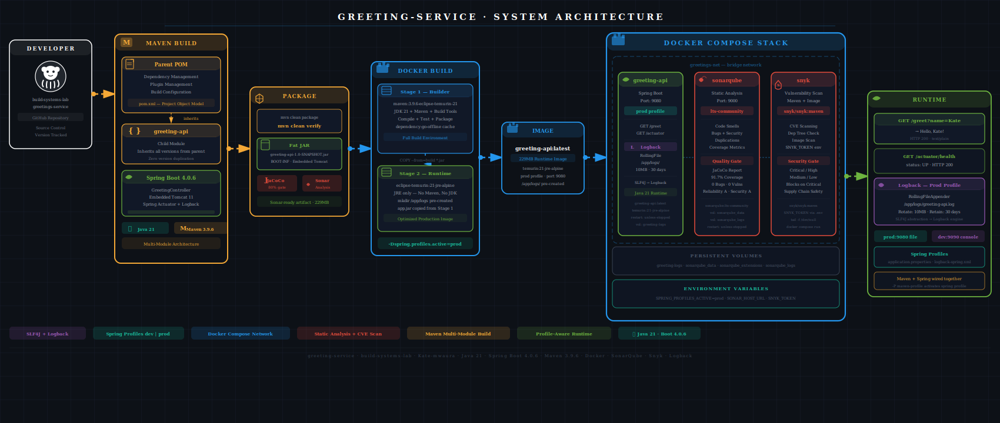

# 1. What This System Is

`greeting-service` is a production-style Spring Boot microservice project built to demonstrate how modern backend systems are structured, packaged, containerized, analyzed, and deployed in real engineering environments. Although the application itself exposes a simple greeting endpoint, the real focus of the project is the engineering ecosystem surrounding the application — multi-module Maven architecture, profile-driven configuration, containerization with Docker, local service orchestration using Docker Compose, centralized logging behavior, static code analysis with SonarQube, dependency vulnerability scanning with Snyk, and production-oriented deployment practices. The system is intentionally designed to simulate how software moves through a real delivery pipeline: source code is managed through a parent-child Maven structure, packaged into a deployable fat JAR, transformed into a lightweight runtime container through a multi-stage Docker build, and orchestrated alongside supporting services as a complete local stack. The architecture favors separation of concerns, maintainability, reproducibility, and operational clarity, making the project less about the complexity of the business logic itself and more about understanding the full lifecycle of how backend systems are built and shipped in modern DevOps-oriented environments.

<!-- index.html -->
<!-- Embedding an SVG architecture diagram inside Markdown-compatible HTML -->

  

---

  <em>
    Figure 1 — High-level architecture flow showing how the Maven multi-module
    build system, Docker containerization, Docker Compose orchestration,
    SonarQube analysis, and Snyk security scanning integrate together
    inside the greeting-service project.
  </em>

