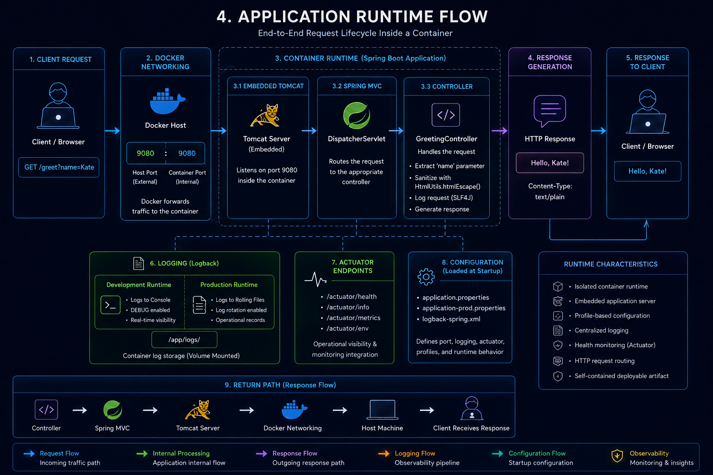
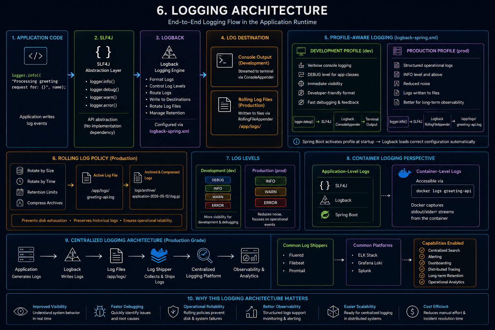

# 1. What This System Is

`greeting-service` is a production-style Spring Boot microservice built to demonstrate how modern backend systems are structured, packaged, and shipped. The application itself is simply a greeting endpoint but the engineering layer around it is the real subject: a Maven multi-module build, profile-driven configuration, Docker containerization, local service orchestration with Docker Compose, structured logging, static analysis with SonarQube, and dependency scanning with Snyk. The system moves through a complete delivery pipeline from source code to a running, observable container, and every tool in the stack exists to show how that pipeline behaves in a real engineering environment.

---

## 2. System Architecture — The Big Picture

An end-to-end view of how the system moves from source code through the Maven build, Docker packaging, Compose orchestration, and into a running observable application.

  

The diagram shows the full end-to-end flow of the system — from the developer and source code through the Maven build, Docker packaging, Compose orchestration, and into the running runtime with observability and security tooling around it.

---

## 3. Maven Multi-Module Architecture

A look at how the parent and child POM relationship is structured and how configuration flows down into the build lifecycle.

  

The diagram shows the parent-child POM relationship — how the parent centralizes dependency management, plugin management, and build configuration, and how the child module inherits that shared setup before being packaged into an executable JAR and transformed into a Docker image through the Maven lifecycle.

---

## 4. Application Runtime Flow

How an incoming HTTP request moves through the containerized application from entry point to response.

  

The container starts the application with the prod profile active, which loads the port, logging, and actuator configuration. Incoming requests hit Docker's port mapping at `9080:9080`, pass through embedded Tomcat into the `GreetingController`, where the name parameter is extracted, sanitized, and logged through SLF4J before a plain text response is returned. Actuator endpoints at `/actuator/health` and `/actuator/info` run alongside the application, exposing runtime health without touching application internals.

---

## 5. Profile-Based Configuration Architecture

How the application loads different configuration depending on the environment it is running in.

  

The application uses three layered properties files — `application.properties` as the shared base, `application-dev.properties` for local development on port `9090` with console logging, and `application-prod.properties` for the container runtime on port `9080` with rolling file logging. The active profile is injected at startup through a JVM argument, environment variable, or Docker Compose configuration, which means the same artifact runs in both environments without any code changes.

---

## 6. Logging Architecture

How log events travel from application code through SLF4J and Logback to their final destination depending on the active profile.

  

The application writes logs through SLF4J, which acts as an abstraction layer sitting between the code and Logback — the actual logging engine. Logback reads the active Spring profile at startup and activates the correct configuration block from `logback-spring.xml`: in dev, logs stream to the console at DEBUG level; in prod, logs are written to a `RollingFileAppender` at `/app/logs/` with size and time-based rotation to prevent disk saturation.

---

## 7. Docker Build Architecture

How the application moves from source code into a lightweight production container image through a two-stage build process.

  

Stage 1 uses a full Maven and JDK image to compile, resolve dependencies, and package the application into an executable JAR. Stage 2 starts fresh from a minimal JRE Alpine image and copies only the final JAR across — leaving behind the compiler, Maven, source code, and dependency cache. The result is a lightweight production image containing nothing beyond the Java runtime and the application artifact.

---

## 8. Docker Compose Network Architecture

How the three containers are connected, networked, and orchestrated together as a single local stack.

  

Docker Compose provisions `greeting-api`, `sonarqube`, and `snyk` as connected services on a shared bridge network called `greetings-net`, where containers discover each other by service name rather than IP address — so `greeting-api` reaches SonarQube at `http://sonarqube:9000` internally. Port mappings expose selected services to the host machine, persistent volumes keep SonarQube data and application logs alive across container restarts, and environment variables inject runtime configuration like `SPRING_PROFILES_ACTIVE=prod` and `SNYK_TOKEN` at startup without touching the image.

---

## 9. Quality and Security Pipeline

How JaCoCo, SonarQube, and Snyk work together to validate code quality and security before the application is considered deployable.

  

JaCoCo instruments the bytecode during the test phase and generates a coverage report, which SonarQube then consumes alongside the source code to produce a full static analysis — checking for bugs, code smells, duplication, and maintainability issues against a quality gate. Snyk runs independently against the Maven dependency tree and the Docker image, scanning for known CVEs and vulnerable transitive dependencies that static analysis alone would not catch.

---

## 10. Deployment Flow

How the system moves stage by stage from source code into a running observable platform.

  

`mvn clean package` compiles, tests, and packages the application into an executable fat JAR, which Docker then picks up through a multi-stage build to produce the lightweight `greeting-api:latest` image. `docker compose up --build` takes that image and brings up the full stack — creating the network, mounting volumes, injecting environment variables, and starting all three containers as a connected operational environment.

---

## 11. Architecture Decisions and Tradeoffs

The reasoning behind the four major structural decisions made across this project.

### Multi-Module Maven Architecture

A single-module structure would have worked for a project this size, but the parent-child split was intentional. The parent POM centralizes dependency versions, plugin configuration, and build behavior in one place — meaning if a new module gets added later, it inherits everything without duplication. The tradeoff is a more complex build structure, which surfaced during Docker builds when the parent POM could not be resolved from the wrong build context. That failure was itself a useful lesson in how multi-module systems behave in containerized environments.

### logback-spring.xml Over application.properties Logging

Spring Boot supports basic logging configuration directly through `application.properties`, but this project uses `logback-spring.xml` because the production logging requirements went beyond what property-based configuration handles cleanly. Rolling file appenders, profile-aware blocks, retention policies, and separate dev and prod destinations all require Logback's XML configuration system. The tradeoff is a more verbose and harder-to-read file, but the result is a logging setup that reflects how production systems are actually configured.

### Multi-Stage Docker Build

A single-stage build would place Maven, the JDK, source code, and build tooling inside the final runtime image. Multi-stage builds solve this by using the first stage purely for compilation and packaging, then copying only the executable JAR into a minimal JRE Alpine image for runtime. Everything else — Maven, the compiler, the source code, the dependency cache — gets discarded. The result is a smaller, more secure image with a reduced attack surface. The tradeoff is slightly more complex Dockerfile configuration and harder debugging if the build stage fails.

### Spring Profiles Over Hardcoded Configuration

Hardcoding environment-specific values into the application creates deployments that are tightly coupled to one environment. Spring profiles solve this by separating dev and prod configuration into dedicated property files that activate at runtime through a single environment variable — `SPRING_PROFILES_ACTIVE`. The same JAR runs locally on port `9090` with console logging and in the production container on port `9080` with rolling file logging without any code changes. The tradeoff is additional configuration files to manage, but the deployment flexibility and environment separation are worth it.

### JaCoCo Coverage Gate at 80%

The 80% instruction coverage threshold was chosen as a practical middle ground. Too low and the gate stops being meaningful — it allows large areas of untested code to ship unchecked. Too high and engineers start writing tests purely to hit a number rather than to validate behavior, producing brittle test suites with meaningless assertions. 80% enforces real testing discipline without becoming an obstacle. Coverage is treated here as an engineering signal, not as the definition of quality.

---

## 12. Future Evolution

Where the architecture naturally grows from here as the system scales beyond a local deployment stack.

### Database Integration

The application is currently stateless — responses are generated in-memory with no persistence layer. The next natural step is adding a relational database like PostgreSQL, which would introduce Spring Data JPA, entity models, repository layers, and schema migration tooling. Docker Compose would extend to orchestrate the database container alongside the API, with a persistent volume keeping data alive across container restarts.

### Kubernetes Replacing Docker Compose

Docker Compose handles local orchestration well but is not built for production scale. Kubernetes would replace it with automated scheduling, self-healing containers, horizontal scaling, rolling deployments, and declarative infrastructure management through Pods, Services, ConfigMaps, and Secrets. The concepts introduced through Compose — networking, service discovery, environment injection, volume management — translate directly into Kubernetes primitives.

### Centralized Logging

The current setup writes logs to a mounted volume inside the container. At scale, logs from multiple services and containers need to be aggregated centrally. A log shipper like Promtail or Fluentd would collect from `/app/logs/` and forward into a platform like Grafana Loki or the ELK stack, enabling searchable logs, cross-service tracing, alerting, and operational dashboards without manually inspecting individual containers.

### GitHub Actions CI/CD Pipeline

Currently all operations — building, testing, quality analysis, Docker packaging — run manually. GitHub Actions would automate the entire pipeline on every Git push: compile, test, JaCoCo coverage, SonarQube analysis, Snyk scan, Docker build, image push, and deployment. This removes human error from the release process and enforces every quality gate automatically before anything reaches a running environment.

### NGINX Reverse Proxy and TLS

The application currently exposes ports directly to the host machine. In production, traffic would pass through an NGINX reverse proxy sitting in front of the Spring Boot container, handling TLS termination, HTTPS, request routing, rate limiting, and security headers. The container itself would no longer be publicly reachable — only NGINX would be exposed.

### Secrets Management with Vault

Environment variables work for local development and small projects but become difficult to manage as systems grow — especially when secrets rotate, teams multiply, or compliance requirements increase. HashiCorp Vault would replace static environment variables with encrypted secret storage, dynamic credentials, rotation policies, and audit logging. Containers would retrieve secrets at startup rather than having them embedded in deployment configuration.